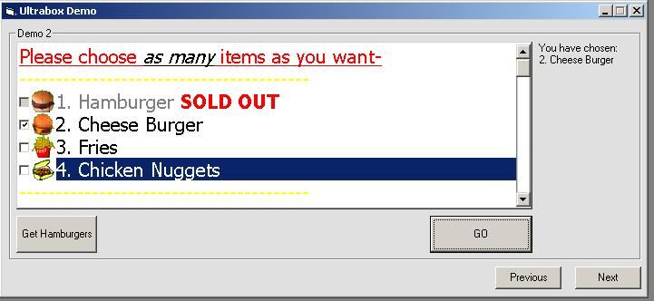



## Ultrabox 2\.0 , A Listbox Replacement

### Description

This is an update to my previous submission.

New updates include:

*A picture can be added to the begining of each item, with optional transparency.

*Bold, Italic, Underline can be added to the items, with the ability to have only part of the string any of those three (or a combo of them)

*Can Enabled/Disable the whole listbox

*Has a Sorted property to sort the list in ABC order. (A bit slow, but its the best I could make, 100 items takes about 1 second)

*MultiSelect, ability to select more then 1 item, while holding down the CTRL button.

Other original features:

*Multicolored items

*Check/Option items

*Horizontal Scrollbar

*Find method and FindInStr.

>Find matches exact string

>FindInstr works if the input is found anywhere in the item, it will be triggered as found.

*Enabled/Disable certain items

*Progressbar Item

*Fill View as either Lined or NoStyle

>Lined with have every other item a light grey, and the other items white.

*5 Different Border Styles

>Raised

>Sunken

>Etched

>Bumped

>Line

>None

To come: A Print method that will allow you to print out the list in a number of formats. I am still having some trouble on this part, but it will come.
 
### More Info
 

             |
---                |---
**Submitted On**   |2003-05-18 15:24:48
**By**             |[Chris Van Hooser](https://github.com/Planet-Source-Code/PSCIndex/blob/master/ByAuthor/chris-van-hooser.md)
**Level**          |Intermediate
**User Rating**    |5.0 (45 globes from 9 users)
**Compatibility**  |VB 6\.0
**Category**       |[Custom Controls/ Forms/  Menus](https://github.com/Planet-Source-Code/PSCIndex/blob/master/ByCategory/custom-controls-forms-menus__1-4.md)
**World**          |[Visual Basic](https://github.com/Planet-Source-Code/PSCIndex/blob/master/ByWorld/visual-basic.md)
**Archive File**   |[Ultrabox\_21589305182003\.zip](https://github.com/Planet-Source-Code/chris-van-hooser-ultrabox-2-0-a-listbox-replacement__1-45547/archive/master.zip)

